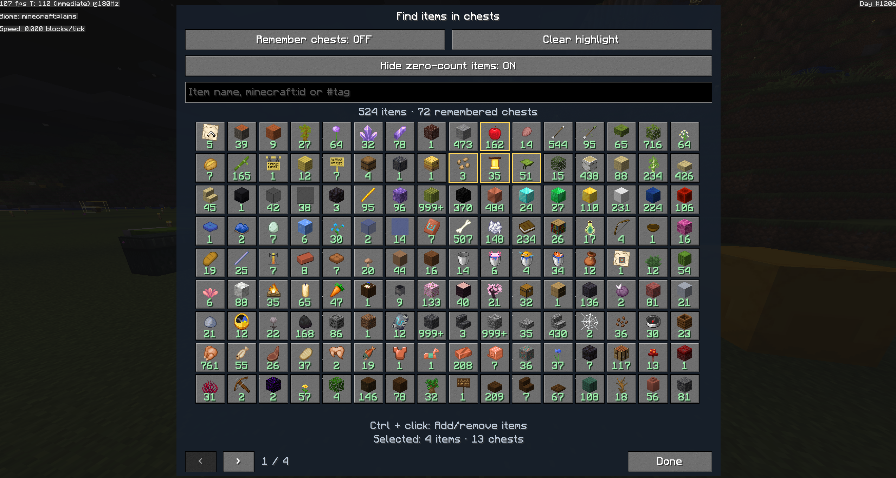
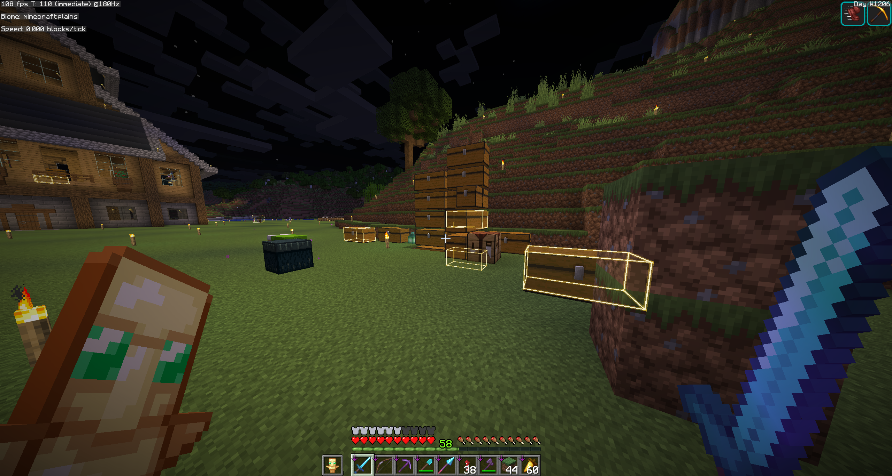

# Chest Item Finder

A client-side Fabric mod for **Minecraft Java 26.3**. Remember opened chests, search for items, and find matching chests with glowing outlines visible through walls.

## Installation

1. Install [Fabric Loader](https://fabricmc.net/use/installer/) **0.19.5 or later** for Minecraft **26.3**.
2. Put `mc-item-finder-1.3.0.jar` and [Fabric API 0.161.0+26.3](https://maven.fabricmc.net/net/fabricmc/fabric-api/fabric-api/0.161.0%2B26.3/fabric-api-0.161.0%2B26.3.jar) in your `mods` folder. Replace any older Item Finder JAR.
3. Launch Minecraft with Fabric. **Java 25** is required.

Install [Mod Menu 21.0.0](https://www.curseforge.com/minecraft/mc-mods/modmenu) if you want settings in the Mods screen. It is optional. No server installation is needed.

## How to use

1. Press **O** to enable chest memory (OFF by default), then open the chests you want to remember.
2. Press **I** to search by item name, ID (`minecraft:diamond`), or tag (`#minecraft:logs`). Numbers under icons show remembered quantities.
3. Click an item to highlight its chests. To select several items, **Ctrl + click** to add or remove them, then press **Done** or **Escape**. Chests containing **any** selected item are highlighted and counted once.

- **Hide zero-count items** shows only items found in remembered chests in the current world and dimension.
- **Clear highlight** clears your selection and stops highlighting.
- Change settings under **Mods → Chest Item Finder → Configure**. Settings persist across restarts.
- Change shortcuts under **Options → Controls → Key Binds → Chest Item Finder**.

The mod's interface is in English. Item names follow your game language.

## Screenshots

Search remembered items, hide zero-count results, and select several items at once.

Matching chests get glowing outlines, including through walls.

## Things to know

- Supports normal, trapped, and double chests. Ender chests, barrels, and shulker boxes are excluded.
- Only chests opened while memory is enabled are recorded. Previously remembered chests remain searchable when memory is disabled.
- Searches use the **last contents you saw**. Reopen a chest with memory enabled after hoppers or other players change it.
- Data stays local in `config/itemfinder/`, separated by world/server and dimension.

## Build

With **JDK 25**, run `./gradlew.bat build` on Windows or `./gradlew build` on Linux/macOS. Alternatively, `./build.ps1` uses the portable JDK in `.tools/jdk25/` when available.

The mod JAR is written to `build/libs/`. Install the regular JAR, not the `-sources.jar`.

License: [MIT](LICENSE).
